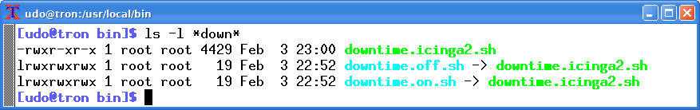

# downtime_icinga2
Shell script to set/remove a downtime to/from a server (and services) for Icinga2

Still early days ... but seems to do the job for basic stuff

The script is intended to be the target of (soft) links which either set or remove downtime(s). The names of the corresponding (soft) links should contain the string "on" and "off", respectively. Personally I use the these file names "downtime.on.sh" and "downtime.off.sh".



```
$ downtime.on.sh 

 This will set/remove a server including all child services in/from Icinga2 maintenance.


 Usage: downtime.on.sh -s <server> <-h icingahost> <-u adminname> <-p password> <-d downtimelength> <-c> 

   -s: the server you want to add a downtime
   -h: where the icinga2 instance is running
   -u: the name of the icinga2 admin user
   -p: the password of the icinga2 admin user
   -d: in seconds starting from now (default is 7200)
   -c: cover child objects of the server

$
$
$
$ downtime.off.sh 

 This will set/remove a server including all child services in/from Icinga2 maintenance.


 Usage: downtime.off.sh -s <server> <-h icingahost> <-u adminname> <-p password>

   -s: the server you want to remove a downtime
   -h: where the icinga2 instance is running
   -u: the name of the icinga2 admin user
   -p: the password of the icinga2 admin user

$

```
